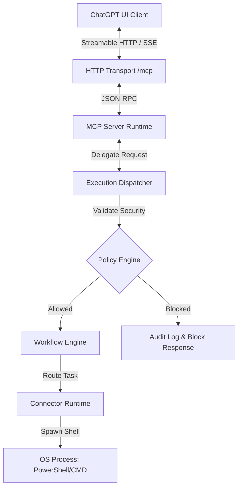

# Platform v2.0 — Universal AI Orchestration Platform

[](https://www.typescriptlang.org/)
[](https://nodejs.org/)
[](https://modelcontextprotocol.io/)
[](#)
[](#)
[](LICENSE)

A distributed, production-ready AI orchestration platform implementing the **Model Context Protocol (MCP)**. Platform v2.0 coordinates multiple AI connector runtimes, multi-agent collaboration sessions, context synchronization, cloud gateways, and sandboxed command execution on Windows environments.

---

## 📖 Project Overview
Platform v2.0 acts as a bridge between high-level Language Model clients (such as ChatGPT or Claude Desktop) and local execution spaces. By leveraging the Model Context Protocol, the platform exposes secure local workspace APIs, persistent terminal sessions, and automated workflow engines. 

It solves key engineering orchestration issues:
* **Asynchronous Long-Running Task Chains:** Executed via step DAGs (Directed Acyclic Graphs).
* **Multi-Agent Voting and Consensus:** Governed by specialized roles.
* **Network-Isolated Local Terminals:** Safely routed via TLS using ngrok tunnels.
* **Security & Path Traversals:** Audited in real time before execution by a strict policy engine.

---

## 🛠️ Features

### 1. Core Platform
* **MCP Server Runtime:** Implements Streamable HTTP, SSE, and local Stdio transport channels.
* **JSON-RPC Handling:** Processes standard JSON-RPC 2.0 payloads for initialization and call handshakes.
* **Event Bus:** Asynchronous, event-sourced nervous system with replay features and local JSONL logging.
* **State Registry:** Generates real-time read-model projections from raw event logs.
* **Workflow Engine:** Resolves task dependency trees and executes step sequences.

### 2. Supported Connectors
* **Claude, Codex, Gemini, OpenAI, Qwen:** Built-in profiles matching prompt structures, thinking markers, and execution wrappers.
* **Antigravity Connector:** Windows shell-backed PowerShell interface with automated prompt stabilization checkups.

### 3. Multi-Agent Collaboration (MACE)
* **Dedicated Roles:** Planner, Architect, Implementer, Reviewer, and Researcher roles.
* **Peer Reviews:** Structural checks before code changes are merged.
* **Consensus voting:** Democratic code approval mechanisms.

### 4. Distributed Runtime (DMAE & DCMS)
* **DMAE Node Cluster:** Distributed heartbeats, worker node discovery, load balancing, and failover task migration.
* **DCMS Context Memory:** Transactional state synchronization with Last-Write-Wins (LWW) conflict resolution.
* **CEGRF Cloud Federation:** Exposes gateway APIs to register remote clusters and securely dispatch tasks.

### 5. Production Systems
* **Observability:** Metric counters, execution traces, and system resource monitors.
* **Security Sandboxing:** Folder boundaries and command blocklists.
* **Audit Logger:** Outputs all run results to `audit_log.jsonl`.

---

## 📐 Architecture Overview



---

## 💻 Technology Stack

| Technology | Purpose | Version |
| :--- | :--- | :--- |
| **TypeScript** | Type-safe development language | `^5.5.2` |
| **Node.js** | Async backend execution runtime | `^20.14.9` |
| **Express** | REST and HTTP transport server | `^4.19.2` |
| **MCP SDK** | Model Context Protocol implementation | `^1.0.1` |
| **ngrok** | Secure remote TLS tunnels | `^1.7.0` |
| **ConsoleBridge** | C# .NET Windows console interop utility | `.NET SDK 8.0` |
| **CORS** | Cross-Origin resource sharing | `^2.8.6` |

---

## 📂 Repository Structure

* `src/`: Core TypeScript source files.
  * `bootstrap.ts`: Orchestrates all managers, server bindings, and startup events.
  * `index.ts`: The main server entry point setting up Express and MCP transport sessions.
  * `eventBus.ts`: Event publishers, subscribers, and log files.
  * `stateRegistry.ts`: Active entity projections and snapshot engines.
  * `terminalManager.ts`: Persistent Windows shell session allocations.
  * `ConsoleBridge.cs`: Native C# Windows console hooks.
* `releases/`: Generated portable release packages, TGZs, and manifests.
* `scratch/`: Diagnostic test scripts and helper runs.

---

## 📋 Prerequisites
* **Node.js:** `v20.x` or later (tested on `v25.7.0`).
* **npm:** `v10.x` or later.
* **Git:** For code management.
* **.NET SDK 8.0 / PowerShell 7:** Required for Windows shell capturing.
* **ngrok Account:** Required if hosting remote connection tunnels.

---

## 🚀 Installation

1. Clone the repository:
   ```bash
   git clone https://github.com/sathish1812kh-hub/Orchestration.git
   cd Orchestration
   ```
2. Install dependencies:
   ```bash
   npm install
   ```
3. Build the application:
   ```bash
   npm run build
   ```
4. Run the validation checks:
   ```bash
   npx ts-node src/testBootstrap.ts
   ```

---

## ⚙️ Environment Variables (`.env`)

| Variable | Description | Default | Required |
| :--- | :--- | :--- | :--- |
| `PORT` | Local HTTP binding port | `5000` | No |
| `HOST` | Local host interface | `127.0.0.1` | No |
| `NGROK_ENABLED` | Set to `true` to start the ngrok tunnel | `false` | No |
| `NGROK_AUTHTOKEN` | Your ngrok authentication token | `None` | Only if NGROK_ENABLED is `true` |
| `NGROK_DOMAIN` | Static ngrok subdomain | `None` | No |

---

## 🛠️ Running the Platform

### Development Mode (TypeScript hot reload)
```bash
npm run dev
```

### Production Start (via scripts)
To launch the compiled server with built-in port conflict cleaning:
```cmd
:: On Windows CMD/PowerShell
start.bat
```

### Stopping the Server
To cleanly stop the server and release port 5000:
```cmd
stop.bat
```

---

## 🌐 Running with ngrok
1. Create a `.env` file in the project root.
2. Add your ngrok token and domain:
   ```ini
   NGROK_ENABLED=true
   NGROK_AUTHTOKEN=your_authtoken_here
   NGROK_DOMAIN=quicksand-sadness-coral.ngrok-free.dev
   ```
3. Run `start.bat`. The tunnel is established and your endpoint becomes available at `https://your-domain.ngrok-free.dev/mcp`.

---

## 📡 API Endpoints

### `GET /health`
Returns current system metrics and active session sizes.
* **Response Output:**
  ```json
  {
    "status": "healthy",
    "uptime": "120s",
    "connectors": 5,
    "sessions": 0,
    "memory": "42MB",
    "version": "2.0"
  }
  ```

### `POST /mcp`
The main JSON-RPC endpoint. Takes client commands for initialization, listing tools, and execution requests.

---

## 🛡️ MCP Tools Inventory
* **Runtime / Shell:** `terminal_execute` (execute commands), `terminal_session_create` (start shells), `terminal_session_list`.
* **Workspace / Files:** `read_file`, `write_file`, `append_file`, `replace_text`, `list_directory`.
* **Git:** `git_execute` (runs git commands).
* **Multi-Agent:** `create_workflow`, `start_workflow`, `workflow_status`.

---

## 🤝 Supported Connectors

| Connector | Status | Capabilities | OS Support |
| :--- | :--- | :--- | :--- |
| **Claude** | Supported | Code Generation, Directory Parsing | Windows, Linux |
| **Gemini** | Supported | Interactive Text Chat | Windows, Linux, macOS |
| **Antigravity** | Supported | PowerShell Interop, Console Buffer Read | Windows (Requires .NET) |
| **OpenAI** | Supported | Structured Tool Calling | Windows, Linux, macOS |

---

## 🧪 Testing

Execute the test runner script to run the complete validation suite:
```bash
node scratch/run_all_tests.js
```
The test suite validates:
* **Unit Tests:** Event Bus, State Registry, and Policy Engine.
* **Integration Tests:** Handshake loops, connector lifecycles, and MACE workflows.
* **Hardening Gates:** Paths checks blocking unauthorized traversals.

---

## 📈 Performance Characteristics
* **Command Latency:** Standard local terminal execution overhead ranges from 15ms to 50ms.
* **ngrok Routing Latency:** Adds 40ms to 120ms network overhead.
* **Memory Constraints:** Node process heap is optimized to remain under 128MB.

---

## 🛡️ Security & Sandboxing
* **Policy Engine:** Commands matching blocklist items (like `rm -rf`, `reg delete`) are blocked immediately.
* **Path Protection:** Restricts access to host operating system directories (like `C:\Windows`).
* **DPAPI Encryption:** Secrets and tokens are encrypted locally using Windows Data Protection API keys.

---

## 🗺️ Roadmap (Platform v3.0)
* **Authentication Tokens:** Integrate bearer authorization policies on all remote endpoints.
* **Docker Sandboxing:** Move execution environments from local child processes into containerized layers.
* **Consensus Improvements:** Refine voting algorithms for MACE peer review runs.
* **Web Dashboard:** Build a clean dashboard visualizing system metrics, cluster node loads, and active logs.

---

## 📄 License
This project is licensed under the MIT License - see the [LICENSE](LICENSE) file for details.

---

## 🤝 Acknowledgements
* The Model Context Protocol team for standardizing agent tools interfaces.
* The Node.js and TypeScript open-source ecosystem contributors.
