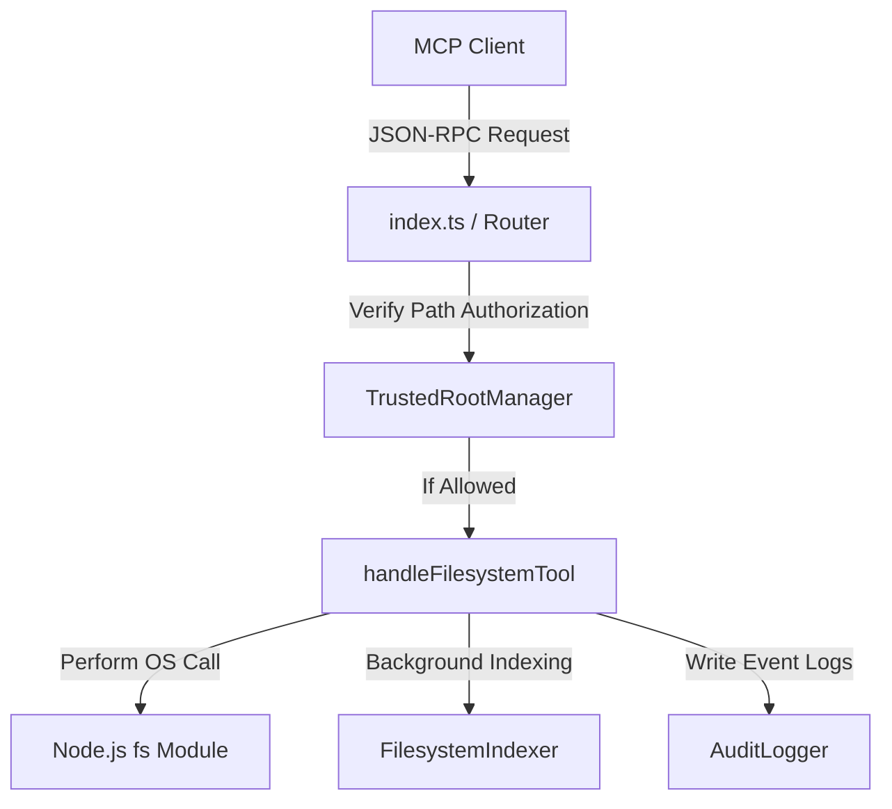

# Filesystem Architecture Specification

This document details the architectural layout, components interaction, and processing flows of the **Enterprise Trusted Filesystem** in Platform v2.0.

---

## 🏗️ Architectural Topology

The subsystem runs on a decentralized model where the gateway coordinates local filesystem actions through a structured routing hierarchy.

### Core Components
1. **TrustedRootManager:** Authorizes path actions based on explicit roots (default: `C:\` on Windows). Normalizes paths, resolves real paths (resolving symbolic links, junctions, and reparse points), and blocks traversal breakouts.
2. **FilesystemIndexer:** An incremental in-memory indexing engine designed to handle large workspaces. Traverses files asynchronously in the background, extracting terms and code symbols (classes, methods, functions) into fast lookup maps.
3. **handleFilesystemTool:** The primary router exposing 66 standardized tools for directory listing, file reads/writes, smart search, and volume mounting.

---

## 🔁 Component Interaction Flow

1. The client invokes a filesystem tool, e.g., `filesystem_write` with arguments `{ path: "C:\\src\\sandbox.txt", content: "..." }`.
2. The router passes the path parameters to `TrustedRootManager.isTrusted(path)`.
3. `TrustedRootManager` normalizes the path and checks it against the registered root mappings list.
4. If authorized, the operation proceeds to write the file, logs the activity via `AuditLogger`, and prompts `FilesystemIndexer` to index the file in the background.
5. If denied, the router immediately blocks execution and throws an `AuthorizationDenied` exception, preserving the host OS integrity.
