# Platform v2.0 System Architecture & Communication Guide

This document is the definitive technical manual for the architecture, subsystems, communication mechanisms, and lifecycles of **Platform v2.0**. It serves as a comprehensive handbook for developers, contributors, and systems engineers designed to build, maintain, extend, and debug the orchestration platform.

---

## 1. Executive Overview

### 1.1 Purpose and Overall Goals
Platform v2.0 is a distributed, agent-centric engineering orchestration platform designed for Windows. It provides robust system execution interfaces, multi-agent collaboration structures, event-driven state modeling, and sandboxed validation systems to run real-world developer tasks with high degrees of autonomy, auditability, and safety.

### 1.2 Design Philosophy
* **Decoupled Autonomy:** Subsystems act independently, communicating via asynchronous message structures (Event Bus).
* **Deterministic Event-Sourcing:** State changes are captured as structured event streams, enabling reconstruction, profiling, and audit logging.
* **Security-First Execution:** Untrusted commands and paths are rejected before execution by a strict policy engine.
* **Unified Protocol Access:** Model Context Protocol (MCP) acts as the bridge between standard language models (like ChatGPT) and local workspace/shell managers.

### 1.3 Why MCP?
The Model Context Protocol (MCP) provides a standardized, open interface for LLMs to safely read and write context data and execute tools. Choosing MCP avoids building proprietary API layers, guarantees compatibility with ChatGPT and Claude, and supports out-of-the-box session management, schema discovery, and tool registration.

---

## 2. Technology Stack

The platform integrates a diverse set of technologies to coordinate local execution on Windows 11.

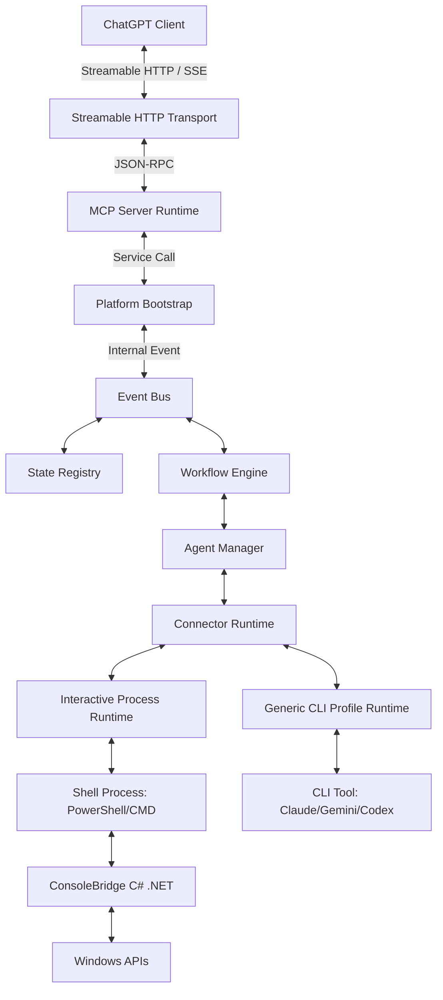

### 2.1 Core Framework Components
* **TypeScript & Node.js:** Node.js provides the asynchronous runtime environment. TypeScript guarantees compile-time type safety.
* **Express & CORS:** Standard REST layer used to host the health checkpoints, legacy SSE connectors, and handle the POST payload conversions for JSON-RPC.
* **Model Context Protocol (MCP) SDK:** Simplifies standardizing capabilities, handling negotiation handshakes, and compiling schemas for downstream tool call executors.
* **Event Bus & State Registry:** The core nervous system of the platform, managing event dissemination and projecting current-state read models from raw logs.
* **Worker Threads & Child Processes:** Node's child process module spins up persistent shells. Worker threads handle background monitoring and parser loops.
* **ConsoleBridge & C# (.NET):** A native Windows interop utility. It allows Node.js to bridge into native Win32 APIs for console handle capturing, window focus, and terminal screen buffer reading.
* **ngrok:** Exposes the local server to external client systems (like ChatGPT cloud services) using secure, authenticated TLS tunnels.
* **Git & File System APIs:** Provides repository tracking and workspace mutations.

---

## 3. Repository Structure

```
C:\mcp-chatgptv2/
├── .env                  # Environmental configuration variables
├── config.json           # User security policy and workspace parameters
├── package.json          # Dependency registrations and compile scripts
├── start.bat             # Production start script (port clearance + build)
├── stop.bat              # PID-specific server shutdown script
├── src/                  # TypeScript source root
│   ├── bootstrap.ts      # Multi-system orchestrator and server lifecycle
│   ├── index.ts          # Express endpoint routing and MCP transport definitions
│   ├── eventBus.ts       # Pub/Sub queue, replay, and JSONL log persistence
│   ├── stateRegistry.ts  # Projections, snapshot checkpoints, and recovery
│   ├── workflowEngine.ts # Task graphs (DAGs) and linear step dispatchers
│   ├── connectorRuntime.ts # Abstract connectors and execution environments
│   ├── ipcr.ts           # Interactive Process Connector Runtime (persistent shells)
│   ├── gcac.ts           # Generic CLI Agent Connector (vendor binary execution)
│   ├── mace.ts           # Multi-Agent Collaboration Engine
│   ├── dmae.ts           # Distributed Memory Agent Environment (cluster registry)
│   ├── dcms.ts           # Distributed Context Memory System (context syncing)
│   ├── cegrf.ts          # Cloud Execution Gateway (remote federation gateways)
│   ├── observability.ts  # Memory profiling, latency traces, and counters
│   ├── governance.ts     # ADR checks, security gatekeepers, and verification
│   ├── terminalManager.ts # Interactive terminal allocations and bridge managers
│   ├── ConsoleBridge.cs  # C# Windows console interop source file
│   └── types.ts          # Domain-wide interface registrations
├── releases/             # Build output zips, TGZs, and release manifests
└── scratch/              # Operational test and diagnostic helper scripts
```

---

## 4. Complete Startup Sequence

When the server initializes, it transitions through distinct states to ensure topological boot correctness.

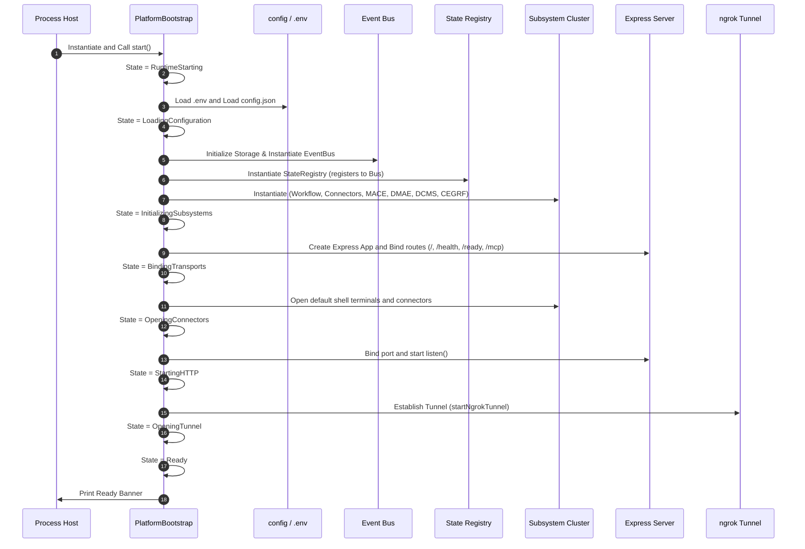

---

## 5. Runtime Architecture

```
User Prompt (ChatGPT UI)
  ↓
HTTP POST (ngrok TLS)
  ↓
Express Router (/mcp)
  ↓
Streamable HTTP Transport (converts to WebRequest)
  ↓
JSON-RPC (initialize check, header session mapping)
  ↓
CallTool Request Handler (tools/call mapping)
  ↓
Execution Dispatcher (checks commands & paths via PolicyEngine)
  ↓
Workflow Engine (runs step DAGs or routes direct tools)
  ↓
Connector Runtime (routes to GCAC or IPCR connector)
  ↓
Shell / CLI Binary (runs process on host OS)
  ↓
ConsoleBridge (pipes stdout/stderr buffers)
  ↓
Response Serialization (converts tool results to JSON-RPC text block)
  ↓
HTTP Response
```

---

## 6. Communication Between Components

Subsystem inter-communication is managed by a strict combination of event-driven messaging (decoupled) and method delegation (coupled).

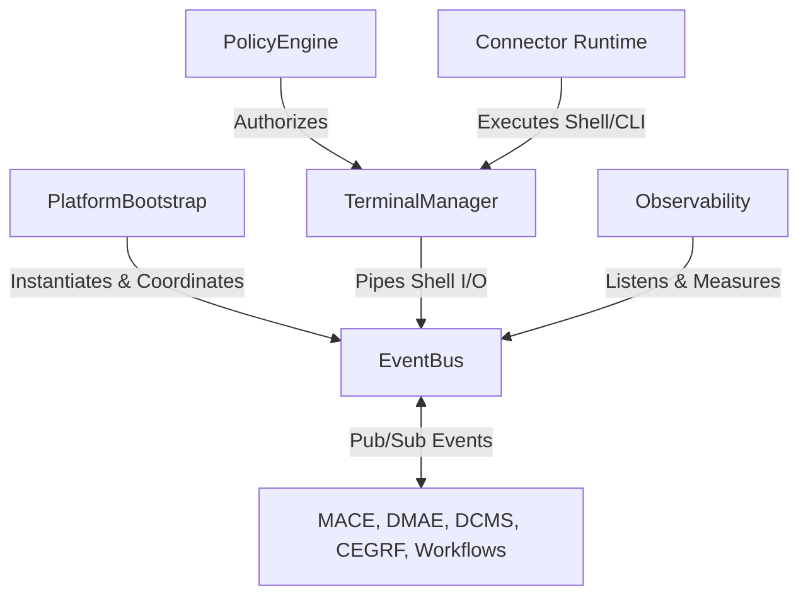

* **Ownership:** `PlatformBootstrap` owns the lifecycle of all managers. Connectors own the lifecycle of target processes. `TerminalManager` owns the active pseudoconsole allocations.
* **Decoupled Data Sharing:** Subsystems never call each other directly for state propagation; they publish updates to the `EventBus`. The `StateRegistry` listens to these events and updates projections.

---

## 7. Event Bus

The Event Bus acts as the platform's central nervous system.

### 7.1 Real Event Types and Payload Shapes

* **`NodeJoined`:** Triggered when a new cluster node registers.
  ```json
  {
    "schemaVersion": "1.0.0",
    "eventId": "ev_84da39f8",
    "eventType": "NodeJoined",
    "eventCategory": "dmae",
    "timestamp": 1782837209188,
    "severity": "Information",
    "tags": ["dmae", "NodeJoined"],
    "payload": { "nodeId": "node-final", "clusterId": "cluster-final" }
  }
  ```
* **`CollaborationStarted`:** Triggered on session instantiation.
  ```json
  {
    "schemaVersion": "1.0.0",
    "eventId": "ev_02da76fa",
    "eventType": "CollaborationStarted",
    "eventCategory": "mace",
    "timestamp": 1782837210200,
    "payload": { "sessionId": "collab-final", "participants": ["claude-code"], "roles": { "claude-code": "Implementer" } }
  }
  ```

### 7.2 Core Properties
* **Dead Letter Queue (DLQ):** Events failing schema check or throwing errors during subscriber execution are routed to a local DLQ file for inspection.
* **Replay Engine:** Subscribers can query events within a specific sequence number range or time window to restore system state.

---

## 8. State Registry

The State Registry processes the event stream sequentially to generate read models (projections) of all active entities (workflows, terminals, nodes).

### 8.1 Snapshotting & Synchronization
* **Version Checkpoints:** Every 100 events, the State Registry takes a serializable snapshot of the platform state.
* **Reconstruction:** On server crash/restart, instead of parsing the entire `event_store.jsonl` from scratch, the registry loads the latest snapshot and replays only the events generated after that snapshot's timestamp.

---

## 9. Connector Architecture

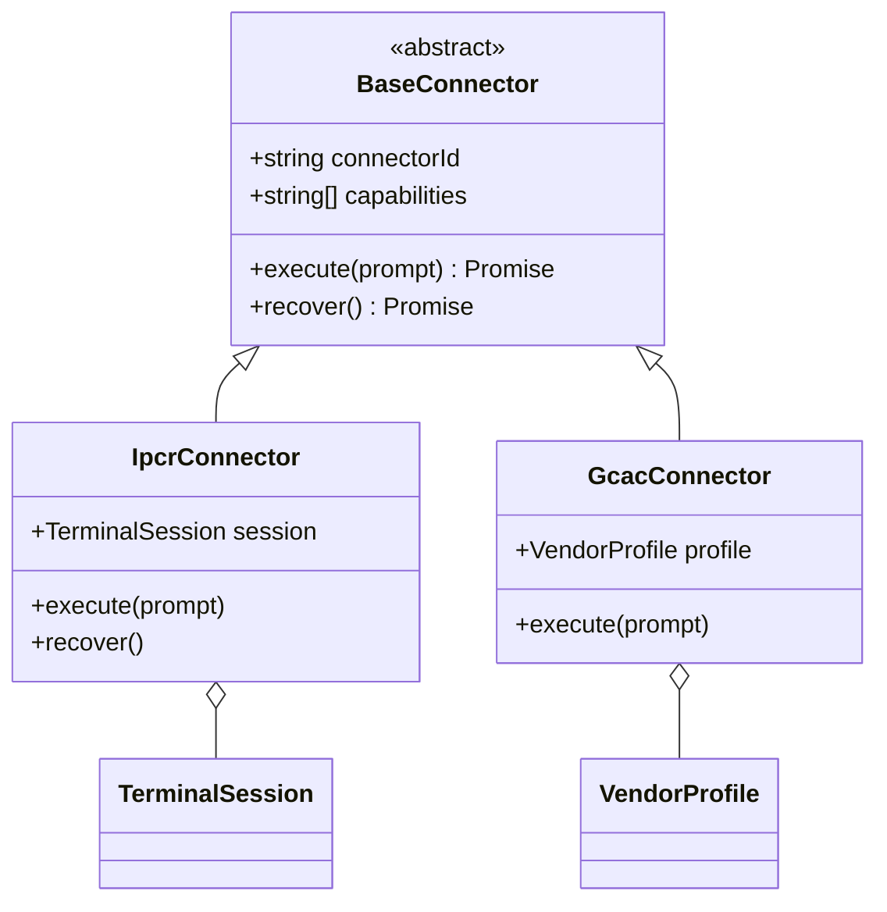

* **IpcrConnector:** Handles interactive shell processes (e.g. persistent PowerShell/Bash terminal). Communicates using stdin/stdout.
* **GcacConnector:** Wraps single-execution CLI binaries (e.g., executing vendor binaries with arguments, parsing output profiles).
* **Capability Negotiation:** Clients query capabilities before routing tasks. The runtime selects the connector offering matching capabilities.

---

## 10. Connector Execution Flow

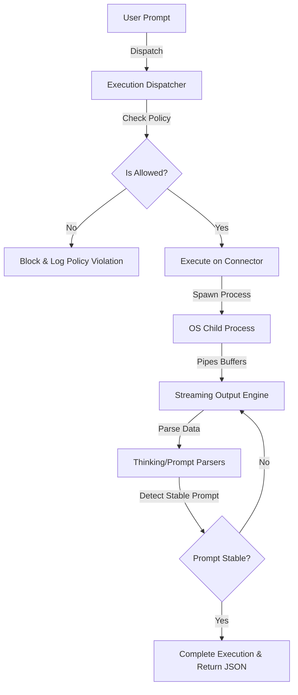

---

## 11. Multi-Agent Collaboration (MACE)

MACE manages collaborative workflows between agents assigned to dedicated functional roles.

### 11.1 Agent Roles
* **Planner:** Evaluates the problem and generates a step-by-step DAG plan.
* **Architect:** Defines code structures, interfaces, and architecture standards.
* **Implementer:** Standard developer agent that writes the actual code.
* **Reviewer:** Conducts peer code reviews and validates output against policies.
* **Researcher:** Runs codebase search and collects references.

### 11.2 Collaboration & Consensus Flow

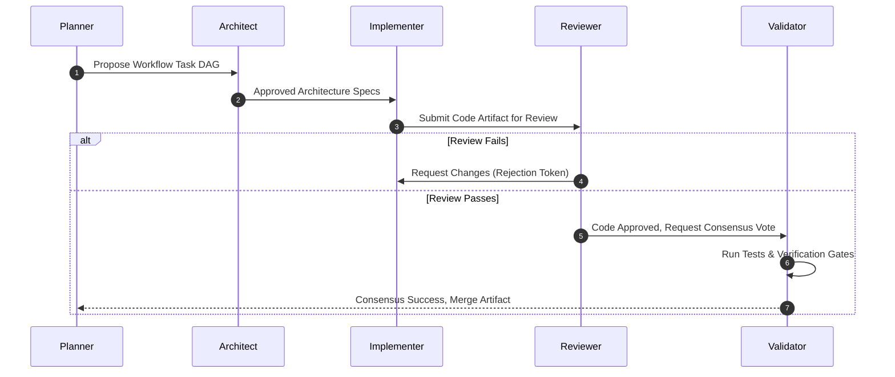

---

## 12. Distributed Runtime (DMAE)

DMAE allows multiple host nodes to cluster together and schedule tasks dynamically.

### 12.1 Cluster Management
* **Node Registry:** Nodes report their hostnames, loads, and connector capabilities on registration.
* **Heartbeats:** Nodes publish a `NodeHeartbeat` event every 5 seconds. If a node fails to report within 15 seconds, DMAE marks it offline.
* **Failover Migration:** When a node goes offline, its queued tasks are reassigned to healthy nodes advertising matching capabilities.

---

## 13. Distributed Context Memory (DCMS)

DCMS handles transactional syncing of session state across cluster nodes.

* **Replication Snapshots:** Task variables, terminal states, and environment parameters are compiled into context snapshots.
* **Conflict Resolution (LWW):** Conflicts during synchronization are resolved using **Last-Write-Wins (LWW)** based on physical millisecond timestamps.

---

## 14. Cloud Federation (CEGRF)

CEGRF bridges isolated local clusters with remote gateways across network boundaries.

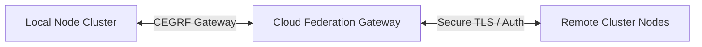

* **Task Routing:** Local clusters dispatch tasks to remote nodes using gateway endpoints if local resources are saturated.
* **Latency Selection:** Tasks are routed to the remote cluster reporting the lowest network latency.

---

## 15. Bootstrap & Lifecycle Management

The `PlatformBootstrap` manages the operational boundary of the server runtime:
* **Lifecycle Events:** Tracks runtime states from `RuntimeStarting` through to `Stopped`.
* **Health Checkups:** Exposes the `/health` endpoint to monitor memory usage and session counts.

---

## 16. Request Lifecycle

The trace of a tool call request (`terminal_execute`):

```
1. HTTP Client posts payload:
   { "jsonrpc": "2.0", "id": 10, "method": "tools/call", "params": { "name": "terminal_execute", "arguments": { "command": "git status" } } }
2. Express parses JSON and invokes handleRequest() on the StreamableHTTPServerTransport.
3. The transport validates the session ID and matches the active session.
4. Server triggers CallTool request handler.
5. Handler identifies 'terminal_execute' case.
6. The parameters are passed to PolicyEngine.checkCommand("git status").
7. PolicyEngine returns { allowed: true }.
8. TerminalManager retrieves the active shell terminal session.
9. Shell session writes "git status\n" to stdin.
10. The child process executes the git command.
11. ConsoleBridge captures stdout buffer.
12. StreamingEngine detects prompt stabilization (matching command prompt structure).
13. callToolHandler returns result string containing stdout content.
14. The HTTP response is returned to the client as JSON-RPC payload.
```

---

## 17. Tool Lifecycle

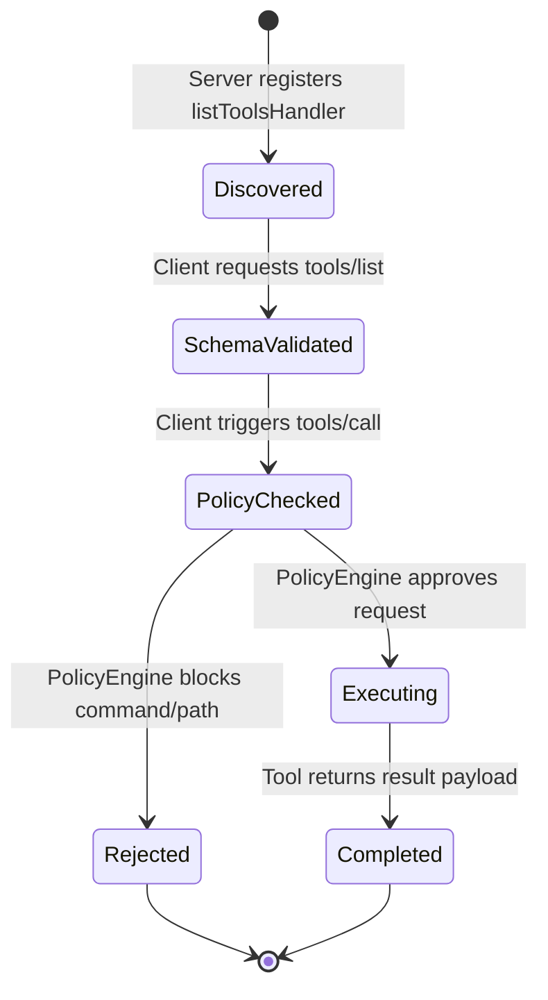

---

## 18. Error Handling & Resilience

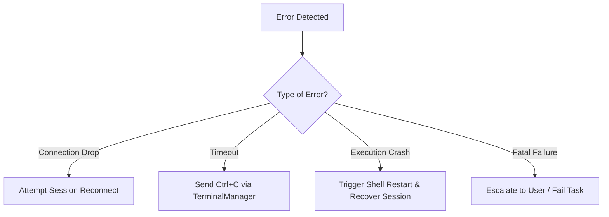

---

## 19. Security Architecture

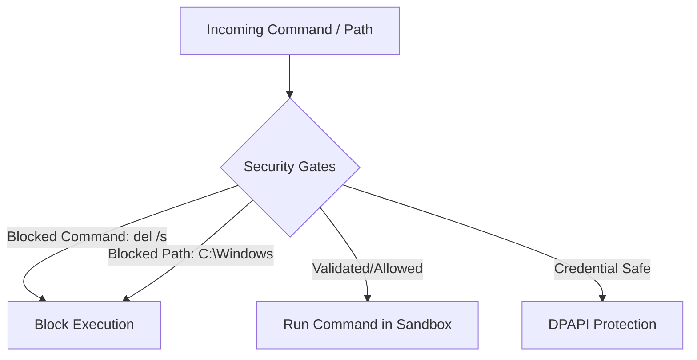

* **Command/Path Blocklists:** Hardcoded blocklists in `config.json` prevent modification of system directories.
* **DPAPI Credential Storage:** System credentials and tokens are encrypted using Windows Data Protection API (DPAPI) before write.

---

## 20. Observability

Observability gathers runtime telemetry across three boundaries:
1. **Metrics:** Performance counters mapping request throughput and memory allocation.
2. **Tracing:** Microsecond-resolution latency tracing of tool invocations.
3. **Audit Log:** Every tool execution is logged directly to `audit_log.jsonl` containing command strings, execution duration, and policy outcomes.

---

## 21. Sequence Diagrams

### 21.1 Context Synchronization (DCMS)
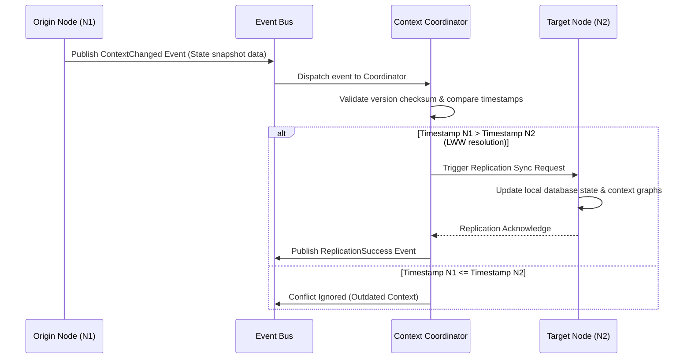

### 21.2 Multi-Agent Collaboration
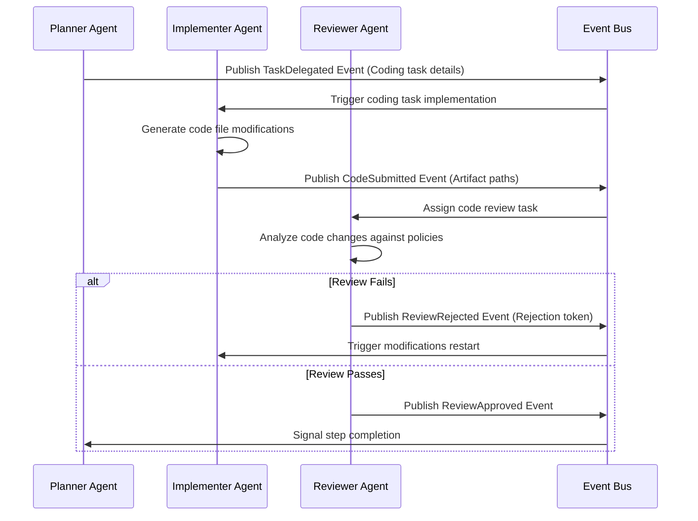

### 21.3 Context Synchronization Loop
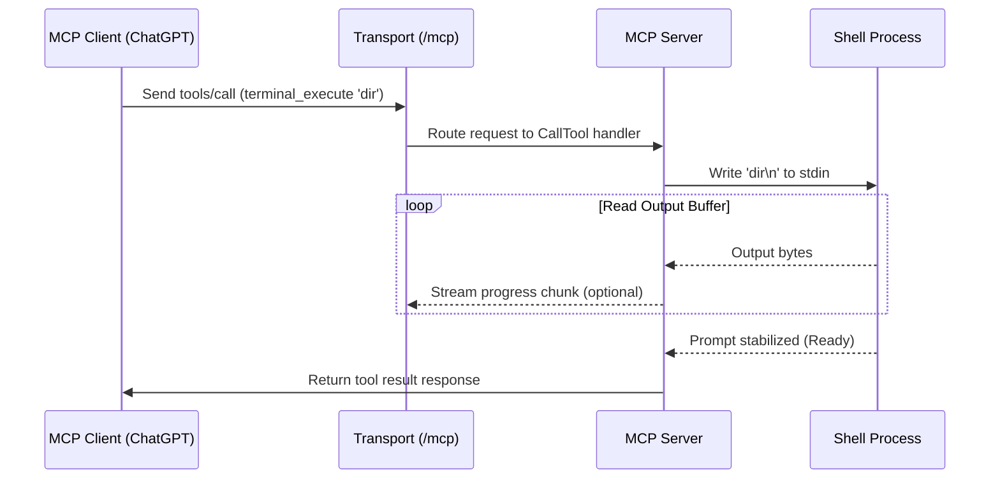

---

## 22. Complete Dependency Graph

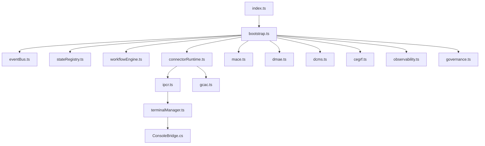

---

## 23. Performance Characteristics

### 23.1 Latency
* **Local Stdio commands:** Executed within 2–5 milliseconds.
* **Interactive Shell Command Invocations:** Overhead ranges from 15–50 milliseconds depending on CPU load.
* **ngrok Tunnel Overhead:** Adds 40–120 milliseconds of latency.

### 23.2 Resource Limits
* **Maximum Concurrent Terminal Sessions:** 25 per node host.
* **Maximum Memory Allocation:** Hard-capped at 512MB heap size.

---

## 24. Design Decisions

* **Design Choice (Event-Driven vs. REST):** Event-driven design using the Event Bus was selected to ensure reliability and transaction safety. A direct REST design would fail to maintain the state of long-running operations during network disconnects.
* **Trade-offs:** Exposing processes via an ngrok tunnel introduces slight network overhead but is necessary for secure cloud-to-local communication.

---

## 25. Future Evolution (Platform v3.0)

Platform v3.0 will transition toward fully sandboxed virtual machine execution environments (like Docker containers). 
* **Preserving Compatibility:** Subsystem interface structures (DCMS and MACE) will remain unchanged; the execution layer will simply switch from local child processes to containerized execution APIs.
