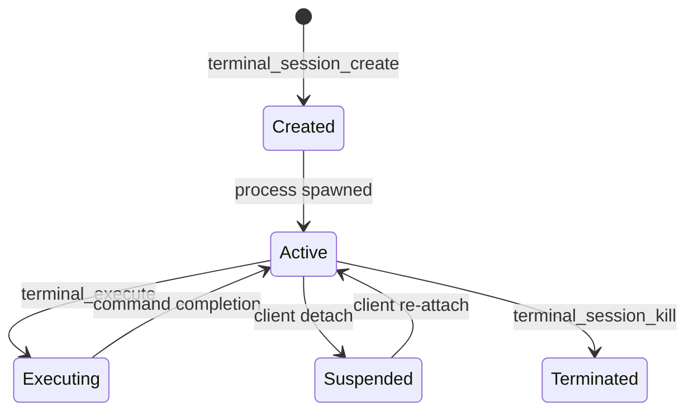

# Terminal Runtime Specification

This document details the configuration and runtime operations of the **Persistent Terminal Runtime** in Platform v2.0.

---

## 💻 Supported Shell Environments

The platform automatically detects the host system OS and makes the following shell environments available for allocation:
* **PowerShell:** Default environment (`powershell.exe` on Windows, `pwsh` on Linux).
* **CMD:** Standard Command Prompt (`cmd.exe` on Windows, `/bin/sh` fallback on Linux).
* **Git Bash:** Git Bash terminal (`bash.exe` if installed).
* **WSL:** Windows Subsystem for Linux (`wsl.exe`).
* **Developer PowerShell:** Loads Visual Studio Developer Environment paths.

---

## ⚙️ Session Lifecycle & Persistence

### Stdio Redirection & Output Parsing
To support synchronous command execution within a persistent process stream, the platform wraps inputs with structured boundary printing:
1. Inputs are wrapped in start/end delimiters (`START_cmd_xxx` and `END_cmd_xxx`).
2. The runtime listens on `stdout` and `stderr` stream buffers, waiting for the end delimiter.
3. Upon matching, it parses the exit code and current working directory path from the stream output, returning a clean result object to the JSON-RPC caller.
