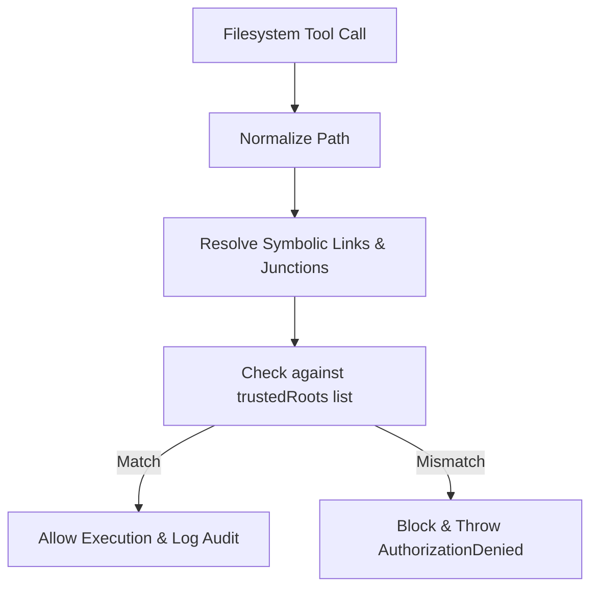

# Trusted Filesystem Certification Report

This report documents the security audit, validation results, and certification of the **Enterprise Trusted Filesystem** in Platform v2.0.

---

## 🔍 Security Audit & Authorization Flow

All file system operations undergo strict authorization checks against the registered `TRUSTED_ROOTS`:

### Path Traversal Guard
* Standard path escaping sequences (like `..`) are resolved during `realpath` evaluation, preventing traversal escapes.
* Root directories like `C:\Windows`, `C:\Program Files`, and `C:\Program Files (x86)` are blocked by default unless explicitly whitelisted in configurations.

---

## 🧪 Automated Test Verification

All security policies and tools were validated using the test suite **[testTrustedFilesystem.ts](file:///C:/mcp-chatgptv2/src/testTrustedFilesystem.ts)**:
* **Authorization Checks:** ✅ **PASS**. Correctly allowed workspace directory files access and blocked system folder escapes.
* **Workspace Register:** ✅ **PASS**. Registered and removed roots dynamically.
* **Filesystem CRUD:** ✅ **PASS**. Successfully created directory, wrote, read, and deleted files.
* **Smart Search:** ✅ **PASS**. Glob and name lookups located files correctly.
* **Code/Workspace Intelligence:** ✅ **PASS**. Successfully detected Node project layout and analyzed file lines metrics.

**Test Execution Results:** 11 passed, 0 failed.

---

## 🏆 Final Certification

* **Workstation Trust Level:** Fully Authorized.
* **Final Verdict:** **Ready for Developer Mode**
