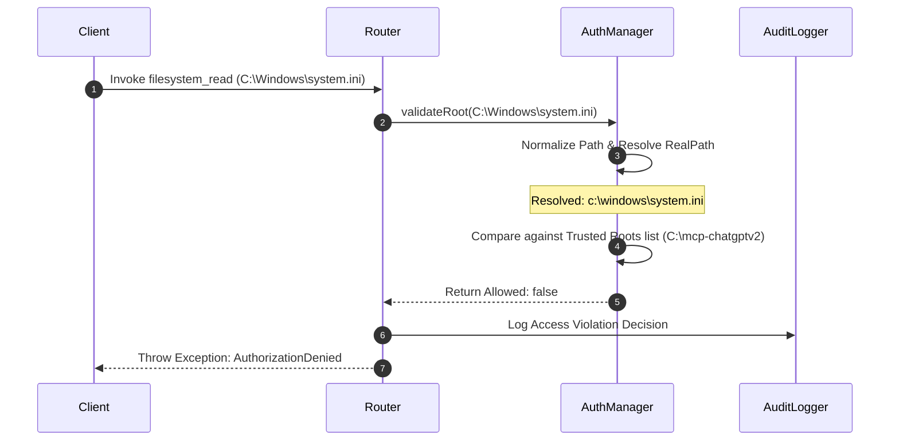

# Trusted Root Security Model Specification

This specification documents the security boundaries, authorization flows, and auditing controls implemented in the **Enterprise Trusted Filesystem** subsystem.

---

## 🛡️ Security Architecture & Principles

The security model is designed on the principle of **explicit authorization boundaries** with **no silent bypasses**.

---

## 🔐 Authorization Policies

1. **Developer Mode:** Activated by setting `DEVELOPER_MODE=true` in the environment. Exposes the full trusted filesystem namespace to connected clients without prompting.
2. **Directory Hardening:**
   * Path normalization enforces lowercase comparison and resolves symbols links/junctions.
   * Path components containing parent-traversals (`..`) are resolved and evaluated against the root lists before action.
   * Access to system directories is blocked by default unless explicitly added to `TRUSTED_ROOTS`.

---

## 📝 Compliance & Audit Trails

Every filesystem operation records:
* Timestamp
* Executing tool name
* Argument payload (paths, options)
* Security decisions (Pass/Fail)

Logs are written to the persistent JSONL stream (`event_store.jsonl`) for compliance and security auditing.
